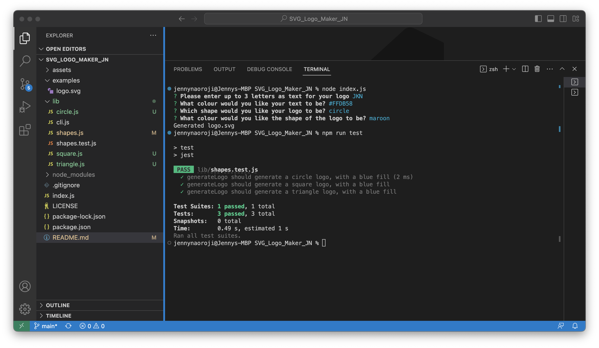
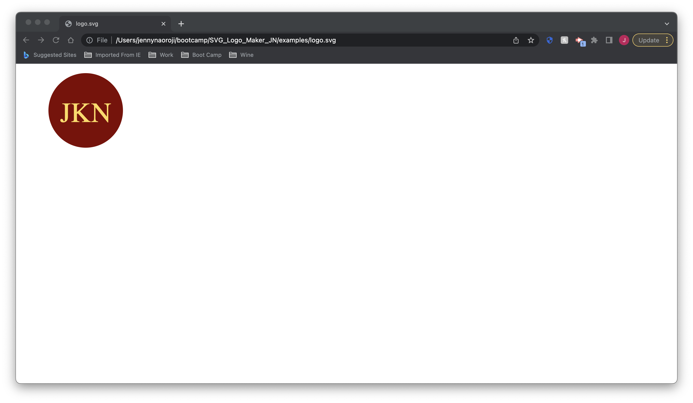

# 10 Object-oriented Programming: Jenny's SVG Logo Maker

## Description

My task is to create a Node.js command-line application that takes in user input to dynamically generate a logo using the [Inquirer package](https://www.npmjs.com/package/inquirer/v/8.2.4) and save it as an [SVG file](https://en.wikipedia.org/wiki/Scalable_Vector_Graphics).
This command line application takes a color keyword or hexadecimal number. It also provides a list of shapes to choose from: circle, triangle, and square. The SVG file generated provides a 
300x200 pixel image.
This command-line application uses [Jest](https://www.npmjs.com/package/jest) for a suite of unit tests and has a link to a walkthrough video that demonstrates functionality.


## Usage

The application prompts the user to select a color and shape of the logo, provide text and text color for the logo, and saves the generated SVG to a `.svg` file.

The application will be invoked by using the following command in the command line:

```bash
node index.js
```

## Screenshot

The following screenshot shows my web application's appearance and functionality:




The following screenshot shows an example of a dynamically generated logo.svg based on user input:




Here is a link to the walkthrough video that demonstrates the functionality of the SVG logo generator:
https://youtu.be/yh5xZdkfQD0


## Credits

* [Inquirer package](https://www.npmjs.com/package/inquirer/v/8.2.4).
* [Fullstack Blog Video Submission Guide](https://coding-boot-camp.github.io/full-stack/computer-literacy/video-submission-guide)
* [Jest](https://www.npmjs.com/package/jest)
* [Example SVG](https://static.fullstack-bootcamp.com/fullstack-ground/module-10/circle.svg)

* [Scalable Vector Graphics (SVG)](https://en.wikipedia.org/wiki/Scalable_Vector_Graphics)

* [SVG tutorial](https://developer.mozilla.org/en-US/docs/Web/SVG/Tutorial)

* [Basic SVG shapes](https://developer.mozilla.org/en-US/docs/Web/SVG/Tutorial/Basic_Shapes)

* [Text in SVG](https://developer.mozilla.org/en-US/docs/Web/SVG/Tutorial/Texts)

* [SVG VS Code extension](https://marketplace.visualstudio.com/items?itemName=jock.svg)
* example image of the output SVG and not the SVG file itself:


* example file structure: 

```md
.  
├── examples/           // Example svg file(s) created with the app
├── lib/                // Folder for classes or functions
    ├── shapes.js       // Exports `Triangle`, `Circle`, and `Square` classes
    ├── shapes.test.js  // Jest tests for shapes
    └── more...         // Additional files and tests
├── .gitignore          // Indicates which folders and files Git should ignore
├── index.js            // Runs the application using imports from lib/
├── package.json
└── README.md           // App description, link to video, setup and usage instructions           
```
## License

[](https://opensource.org/licenses/MIT)
Please refer to the LICENSE in the repo or click on the badge for documentation.


